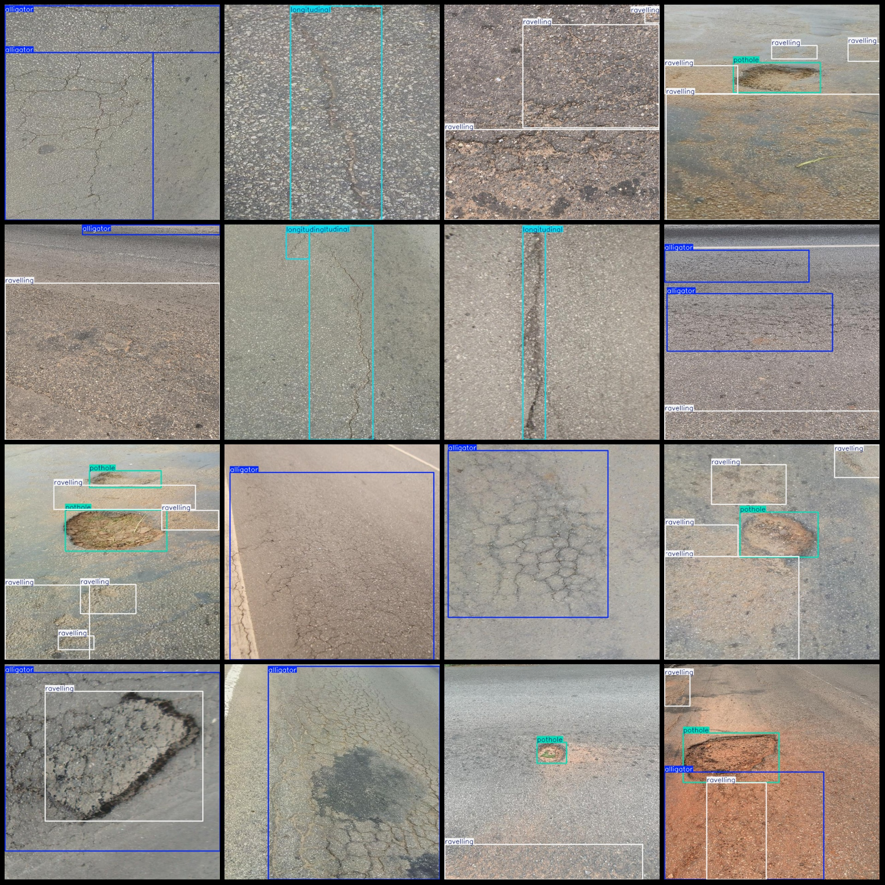
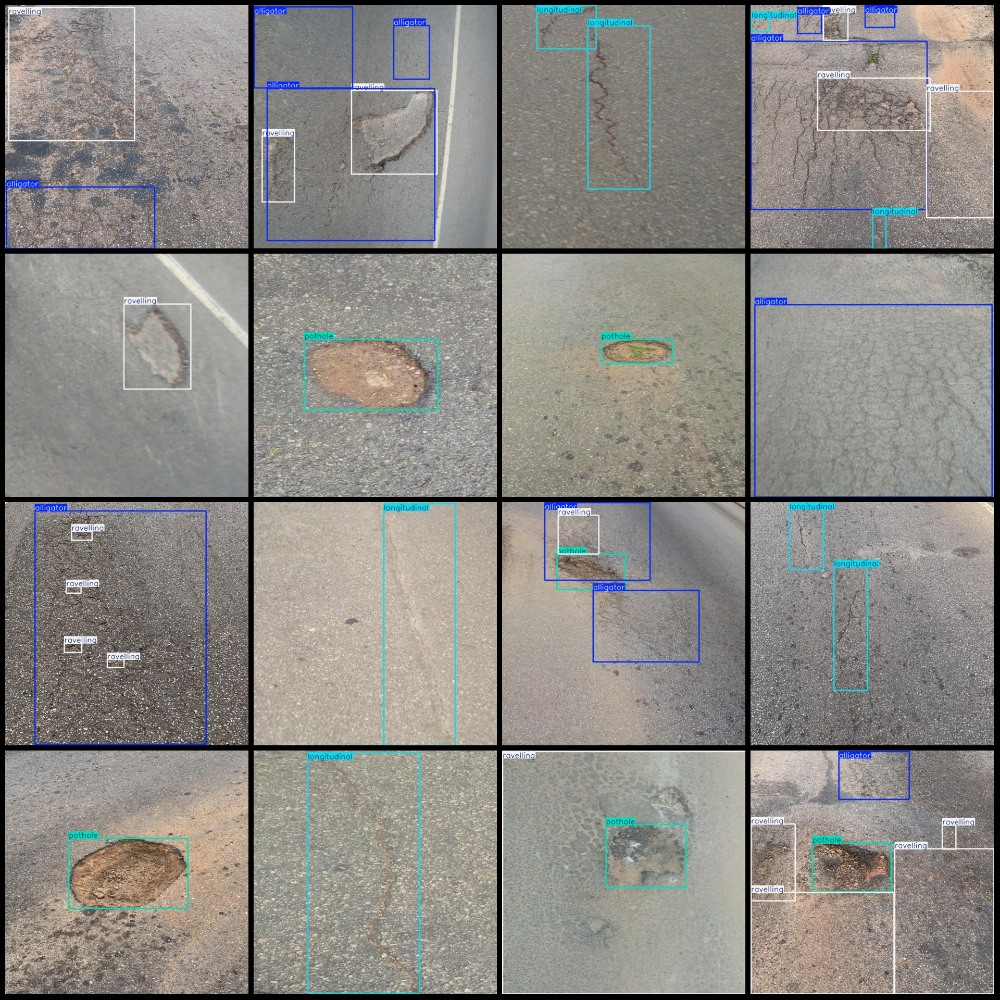

# Wisdom Traffic Asphalt Road Damage Defect Detection Dataset (VOC+YOLO Format) - 547 Images in 4 Categories

Dataset format: Pascal VOC format + YOLO format (excluding the split path's txt file, only including jpg images as well as corresponding VOC format xml files and YOLO format txt files)

Number of images (jpg file count): 547
Number of annotations (xml file count): 547
Number of annotations (txt file count): 547
Number of annotation categories: 4
Annotation category names (note that the order of categories in the YOLO format does not correspond to this, but according to the labels folder "classes.txt" is the correct one): ["alligator", 
"longitudinal", "pothole", "ravelling"]

Number of boxes per category:
- Alligator (Crocodile Wrinkle Cracks) box count = 409
- Longitudinal (Longitudinal Cracks) box count = 194
- Pothole (Pit or Hole) box count = 166
- Ravell (Ravillion) box count = 777
Total box count: 1546

Image resolution: 640x640

Annotation tool used: labelImg
Annotation rules: Draw a box around the category

Important note: The dataset does not have been split into training, validation, or test sets; you will need to do so yourself.
Special declaration: This dataset does not guarantee the accuracy of the trained models or weights files.

Image previews:

Annotation examples:

## Images

Here is a pay link on Stripe ( https://buy.stripe.com/3cs8yP7sY87d0vu9AB ). Please contact me lonlonago@foxmail.com after funding $89, and I will send you a complete data files , thank you!

